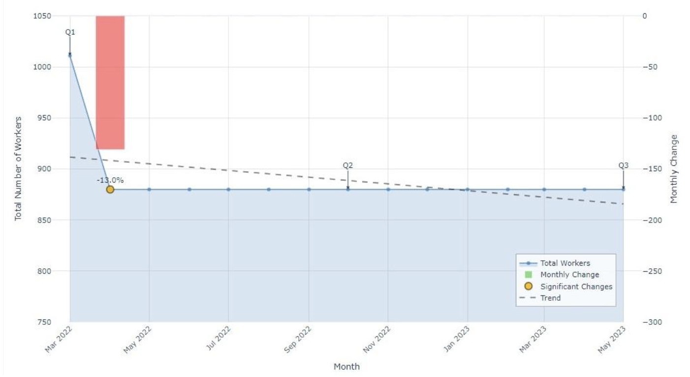
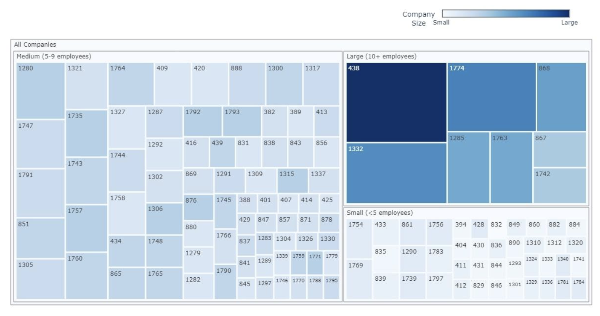
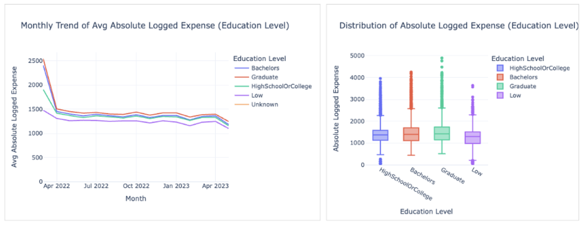
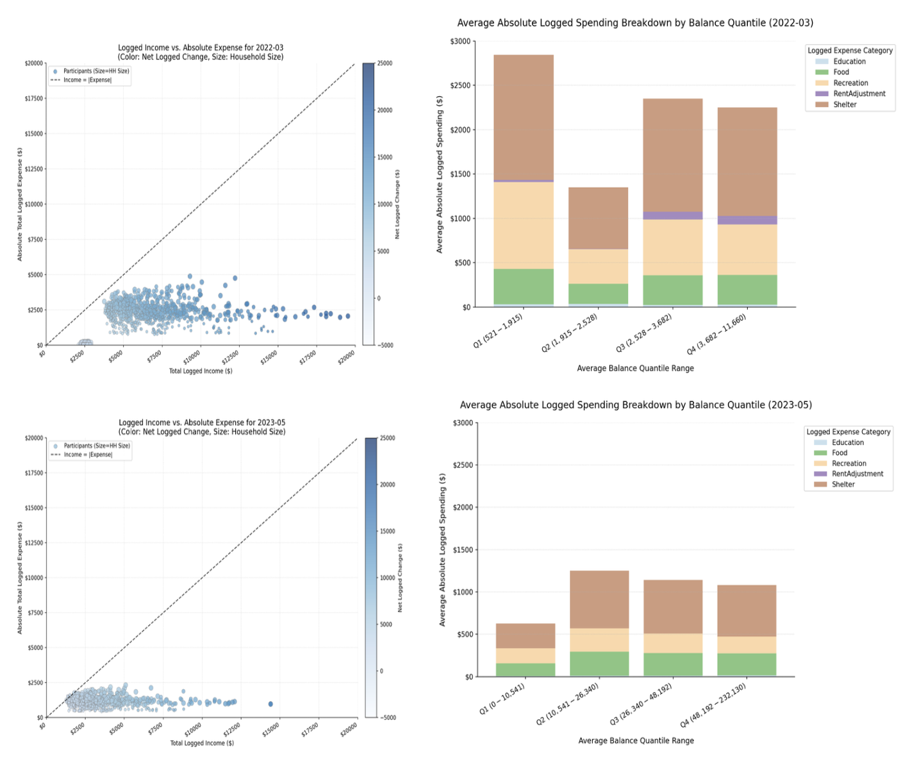

# FinancialView — Visual Analytics for Urban Economic Health

<p align="center">
  
</p>


<p align="center">
  <strong>An interactive visual analytics system for exploring business dynamics, resident financial well-being, and local business performance.</strong>
</p>


<p align="center">
  
  
  
  
  
  
  
</p>


---

## Overview

**FinancialView** is a multi-module visual analytics system built for the [IEEE VAST Challenge 2022 (Challenge 3: Economic)](https://vast-challenge.github.io/2022/description.html). The system analyzes the economic health of **Engagement, Ohio** — a city preparing for rapid growth that has received an urban renewal grant — using 15 months of activity data from ~1,000 volunteer residents.

The system addresses three core analytical questions:

| Module                        | Question                                                     | Tech                            |
| ----------------------------- | ------------------------------------------------------------ | ------------------------------- |
| **Business Turnover**         | How are employers faring? What are the layoff patterns?      | Dash + Plotly                   |
| **Resident Financial Health** | How do residents' incomes compare to expenses across demographics? | Streamlit + Altair + Matplotlib |
| **Business Revenue**          | How does foot traffic correlate with pub/restaurant revenue? | Plotly                          |


---

## Key Findings

<table>
<tr>
<td width="33%" valign="top">


### 📉 Employment Decline

A **13% drop** in the working population was observed, with layoffs concentrated geographically and disproportionately affecting medium-sized employers.

</td>
<td width="33%" valign="top">

### 💰 Financial Inequality

Residents with Graduate/Bachelor's degrees showed **consistent balance growth**, while those with HighSchool/Low education saw **flat or stagnant** savings over 15 months.

</td>
<td width="33%" valign="top">

### 🍺 Revenue Collapse

Pubs experienced the **sharpest decline** in both foot traffic and revenue, with a strong positive correlation between the two — fewer visits directly meant less income.

</td>
</tr>
</table>

---

## Visualizations

### Business Turnover Module

|                  Monthly Working Population                  |               Layoff Geography (Mar–Apr 2022)                |                   Layoffs by Employer Size                   |
| :----------------------------------------------------------: | :----------------------------------------------------------: | :----------------------------------------------------------: |
|                          |                               |                                  |
| Line chart with trend projection and significant change markers | Spatial map with color-intensity encoding for layoff concentration | Treemap categorized by company size (Small / Medium / Large) |

### Resident Financial Health Module *(Interactive — Streamlit + Altair + Matplotlib)*

|                    Group Comparison View                     |                    Detailed Monthly View                     |
| :----------------------------------------------------------: | :----------------------------------------------------------: |
|                         |                         |
| Monthly trend lines + box plot distributions segmented by Education Level, Age Group, etc. | Income vs. Expense scatter plot (color = net change, size = household size) + stacked spending breakdown |

### Business Revenue Module

|             Revenue vs. Foot Traffic (Animated)              |                 Weekly Trends by Venue Type                  |
| :----------------------------------------------------------: | :----------------------------------------------------------: |
|                          |                            |
| Animated bubble chart — x: check-ins, y: revenue, size: avg spending per visit | Dual Y-axis line chart tracking revenue (left) and foot traffic (right) |

---

## System Architecture

```
┌─────────────────────────────────────────────────────────┐
│                    VAST Challenge 2022 Data              │
│  Activity Logs  ·  Attributes  ·  Journals (Financial,  │
│                                    Check-in)             │
└───────────────┬─────────────────────────────────────────┘
                │
                ▼
┌─────────────────────────────────────────────────────────┐
│              Data Preprocessing Pipeline                 │
│  Python scripts for cleaning, aggregating, and joining   │
│  raw data into module-specific intermediate CSVs         │
│                                                          │
│  ┌──────────────┐ ┌──────────────┐ ┌──────────────────┐ │
│  │ Turnover     │ │ Financial    │ │ Revenue          │ │
│  │ Aggregation  │ │ Aggregation  │ │ Aggregation      │ │
│  └──────┬───────┘ └──────┬───────┘ └──────┬───────────┘ │
└─────────┼────────────────┼────────────────┼─────────────┘
          ▼                ▼                ▼
┌──────────────┐ ┌──────────────────┐ ┌──────────────────┐
│  Dash +      │ │  Streamlit +     │ │  Plotly          │
│  Plotly      │ │  Altair +        │ │  Interactive     │
│              │ │  Matplotlib      │ │  HTML            │
│ • Timeline   │ │ • Stacked bar    │ │ • Animated       │
│ • Map view   │ │   drilldown      │ │   scatter plot   │
│ • Treemap    │ │ • Scatter plot   │ │ • Dual-axis      │
│              │ │                  │ │   line chart     │
└──────────────┘ └──────────────────┘ └──────────────────┘
   Module 1           Module 2             Module 3
```

---

## Project Structure

```
financialview-vast-2022/
│
├── README.md
├── requirements.txt
│
├── data-processing/
│   ├── README.md                          # ETL pipeline documentation
│   ├── requirements.txt
│   └── scripts/
│       ├── preprocess_turnover.py         # Employment change aggregation
│       ├── preprocess_financial.py        # Monthly participant financial summary
│       └── preprocess_revenue.py          # Venue check-in + revenue join
│
├── modules/
│   ├── business-turnover/
│   │   ├── README.md                      # Module documentation
│   │   ├── app.py                         # Dash dashboard (map + treemap + stats)
│   │   ├── layoff_timeline.py             # Working population timeline (Plotly)
│   │   ├── layoff_map.py                  # Geographical layoff map (Plotly)
│   │   └── layoff_treemap.py              # Layoffs by employer size (Plotly)
│   ├── resident-financial-health/
│   │   ├── README.md                      # Module documentation
│   │   ├── app.py                         # Streamlit dashboard (stacked bar drilldown)
│   │   └── scatter_income_vs_expense.py   # Income vs. expense scatter (Matplotlib)
│   └── business-revenue/
│       ├── README.md                      # Module documentation
│       └── revenue_visualizations.py      # Animated scatter + trend chart (Plotly)
│
├── analysis/
│   ├── requirements-analysis.md           # VAST challenge question → design mapping
│   └── design-decisions.md                # Chart selection rationale & alternatives
│
├── report/
│   └── MSBD5005_Final_Report.pdf
│
└── images/                                # Figures from the report
```

---

## Quick Start

### Resident Financial Health Module (Streamlit App)

```bash
# Clone the repository
git clone https://github.com/kozykong/vast2022_hkust-data-VIZ-.git
cd financialview-vast-2022

# Install dependencies
pip install -r requirements.txt

# Run the interactive dashboard
cd modules/resident-financial-health
streamlit run app.py
```

### Business Turnover Dashboard (Dash App)

```bash
cd modules/business-turnover
python app.py
# Open http://127.0.0.1:8050
```

### Prerequisites

- Python 3.9+
- Preprocessed CSV files (generated from the VAST Challenge 2022 dataset via `data-processing/scripts/`)

---

## Data

The system uses the [VAST Challenge 2022](https://vast-challenge.github.io/2022/description.html) dataset, which includes:

| Source                  | Description                   | Key Fields                                                   |
| ----------------------- | ----------------------------- | ------------------------------------------------------------ |
| Activity Logs           | High-frequency status updates | Location, job, account balance, spending budget              |
| Participant Attributes  | Static demographic info       | Education level, age group, household size                   |
| Employer/Job Attributes | Company and role metadata     | Company size, location, job type                             |
| Financial Journal       | Transaction-level records     | Category (Wage, Food, Shelter, Recreation, Education), amount |
| Check-in Journal        | Venue visit logs              | Venue ID, timestamp, venue type                              |

> **Note**: Raw data is not included in this repository. See [VAST Challenge 2022](https://vast-challenge.github.io/2022/description.html) for dataset access.

---

## Design Rationale

Detailed design documentation is available in the [`analysis/`](analysis/) folder:

- **[Requirements Analysis](analysis/requirements-analysis.md)** — How VAST challenge questions map to design requirements (DR1–DR3)
- **[Design Decisions](analysis/design-decisions.md)** — Why each chart type was selected, alternatives considered, color and interaction strategies

Key design principles:

- **Modular multi-view architecture** — focused analysis per domain while enabling cross-module insight synthesis
- **Consistent visual encoding** — time on x-axis, categorical data as color, quantitative data on y-axis / size / intensity
- **Interactive exploration** — user-selectable parameters for demographic filtering, month selection, and animated timeline scrubbing

---

## Tech Stack

| Component                              | Technology             |
| -------------------------------------- | ---------------------- |
| Data Preprocessing                     | Python (Pandas, NumPy) |
| Business Turnover Dashboard            | Dash, Plotly, Shapely  |
| Resident Financial Health Dashboard    | Streamlit, Altair      |
| Resident Financial Health Scatter Plot | Matplotlib             |
| Business Revenue Visualizations        | Plotly Express         |

---

## Course

**MSBD5005 — Data Visualization**  
MSc in Big Data Technology, Hong Kong University of Science and Technology (HKUST)  
Spring 2025

---

## License

This project was developed for academic purposes as part of HKUST coursework. The VAST Challenge 2022 dataset is provided by IEEE VAST.
