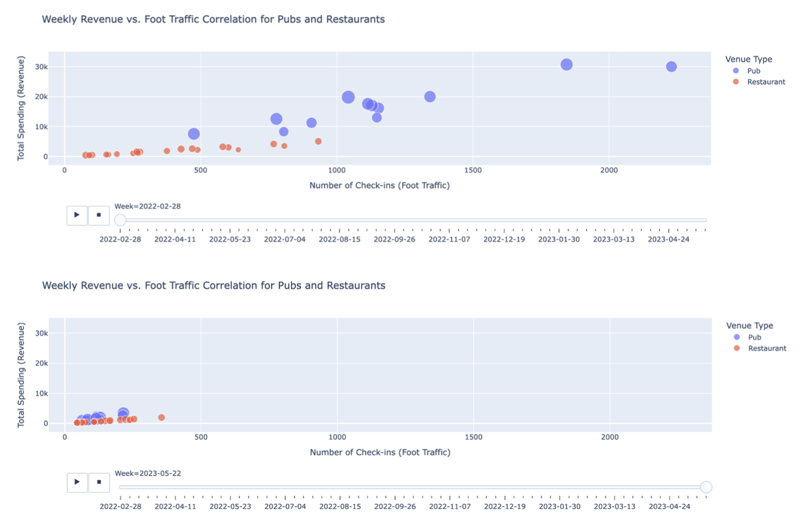
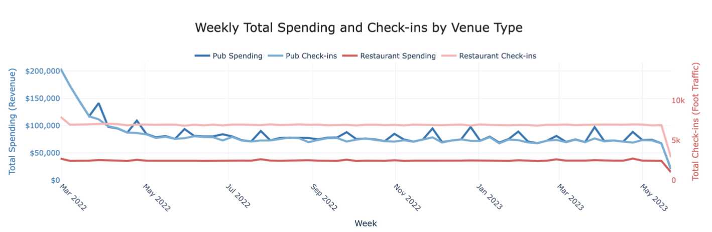

# Business Revenue Module

> **Plotly-based interactive visualizations** analyzing the relationship between foot traffic and revenue for pubs and restaurants in Engagement, Ohio.

---

## Components

### `revenue_visualizations.py`

Single script that generates both visualizations as interactive HTML files.

### 1. Revenue vs. Foot Traffic Correlation (Animated Scatter Plot)

Interactive bubble chart showing the relationship between check-ins and revenue for each venue.

- **X-axis**: Number of check-ins (foot traffic)
- **Y-axis**: Total revenue
- **Bubble size**: Average spending per visit
- **Color**: Venue type (Pub vs. Restaurant)
- **Animation**: Timeline bar + play button to scrub through weeks

### 2. Weekly Trends by Venue Type (Dual Y-Axis Line Chart)

Tracks revenue and foot traffic over time on synchronized axes.

- **Left Y-axis**: Total spending (revenue)
- **Right Y-axis**: Total check-ins (foot traffic)
- **X-axis**: Week
- **Line color**: Differentiates venue type and metric

---

## Key Findings

- Strong positive correlation between foot traffic and revenue — fewer visits directly translate to lower income
- Both metrics show a sustained downward trajectory over the 15-month period
- Pubs experienced the sharpest decline in both foot traffic and revenue compared to restaurants
- The decline pattern suggests ongoing structural economic challenges rather than short-term disruptions

---

## Screenshots

| Revenue vs. Foot Traffic | Weekly Trends |
|:---:|:---:|
|  |  |

---

## Data Source

Uses `weekly_venue_revenue_traffic.csv` generated by `data-processing/scripts/preprocess_revenue.py`.
